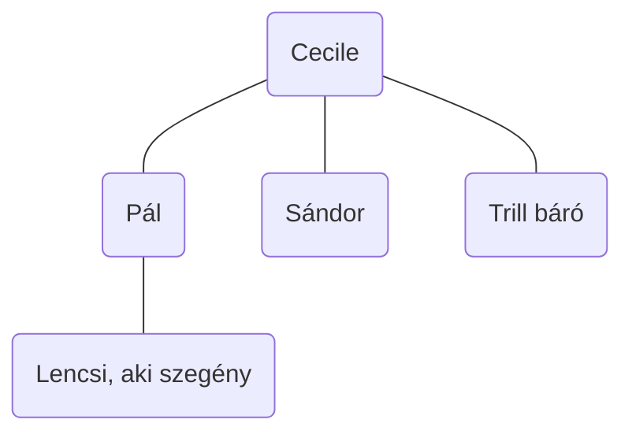

## Helye irodalmunkban
- Magyar író volt
- Legkiemelkedőbb történelmi tárgyú műve Az élet kapuja (1919) című kisregény, melyet a magyar Nobel-díj Bizottsága háromszor is irodalmi Nobel-díjra jelölt.
## Pályaképe
- Sziléziai sváb családban született, Délvidéken, Versecen (Bánság, ma Szerbia)
- Édesapja Herzog József gyógyszerész volt, édesapja Hoffmann Lejza, Hoffmann István építész lánya.
- A polgári családban mindhárom gyermeküket az író nővérét, Máriát és bátyját, Józsefet is tanították
**Tanulmányai**:
- Herceg az elemi iskola után Temesvárra került, a piarista gimnáziumba, ahol megtanult magyarul.
- Középiskolai tanulmányait Szegeden és Fehértemplom folytatta és fejezte be.
- Budapestre érkezett jogot tanulni az egyetemen, majd jogászként dolgozott Temesvár és Budapesten.
- Azonban már akkor tudta, hogy az irodalomban akar dolgozni.
# Művei
- Fenn és lenn (regény)
- Pogányok (regény)
- Az élet kapuja (regény)
## A Kék róka értelmezése
**Műfaj**: színmű (középfajú dráma), komédia
**Téma**:
**Idő, tér, cselekmény**: Fellelhetők az ókori görög és a klasszicista drámák „hármas egység” elvén nyugvó szerkesztési szabályai: a cselekmény egy fő szálon fut, egy helyszínen játszódik, de az időkezelése már a reneszánsz drámákéra hasonlít, mert az utolsó felvonás cselekménye nem egy nap alatt játszódik, hanem közel másfél év történéseit sűríti össze.
**Szerkezet**: 
**Szereplők felsorolása**:
- Pál
- Sándor
- Cecile
- Lencsi, aki szegény
**Szerelmi ötszög**:

**Szereplők jellemzése**:
- **Pál** -> tudós, professzor, a magyar vízi hidrákkal foglalkozik (csalánozók rendje, férgek)
	egy szakbarbár, kicsit bárgyú, csak a férgeivel foglalkozó tudós, akinek nem is lett volna szabad megházasodni. Van annyira intelligens, hogy ezt be is látja, tudja, hogy Cili unatkozik mellette, nem szereti igazán. Ezért hajszolja a kék rókát, a boldogság jelképe is lehet. A házasságukat is csak egy rossz véletlennek tartja. Ezért nem bánta volna, ha felesége Sándorral megcsalja. Ez a konvenciókhoz (hagyományokhoz) való ragaszkodását és együgyűségét is mutatja.
- **Sándor** -> a férj régi jó barátja (majd házibarát)
	a többiekhez képest érdekesebb személyiség. Ő az egyetlen, akinek a gondolkodásmódja, felfogása változik a komédia végére. Először brutális indulatok, gyűlölet, bosszúvágy jellemzik. Svájcban döbben rá, hogy Cili nélkül céltalan az élete, ha igaz, ha nem megbocsájtja Trill bárót és feleségül veszi Cilit.
- **Trill báró** -> aviatikus -> repüléssel foglalkozó szakember, de van egy átvitt értelmű jelentése is -> léhűtő, semmittevő
vagány
- **Cecile** (Cili) -> Pál felesége
	látszólag az unatkozó „szépasszonyok” közé tartozik, aki a kék róka hajszolásával talán a boldogság utáni vágyát fejezi ki. Cili azonban nem csak szép, de okos is. Határozottan törekszik álmai megvalósítására. Ő és Sándor már az esküvő előtt szerették egymást, de Sándor nem akarta elvenni legjobb barátjától a menyasszonyát. „Házibarátként” is kapcsolatuk csak érzelmi alapon működött. Cili a férjét tekinti barátjának, Sándort pedig
	szerelmének, férjének. Ezért mindent megtesz, hogy sikerüljön Páltól elválnia, még jó híre árán is, és hozzámenni Sándorhoz. Végül eléri célját, boldogok lesznek.
- **Lencsi, aki szegény** -> Pál és Cecile „fogadott leánya” (egy szegény lány, akin segítenek)
	a gazdag középosztályba akar betörni, semmilyen sunyi, alattomos, hazug módszertől nem riad vissza. Sikerül is Pál és Cili válása után behálóznia Pált. Igazából Sándort akarta megszerezni, de szeretőnek is megfelelne. Sándor mereven kitér előle. A sznob Lencsi kénytelen egész életét mulya férjével végig élni.
**Cím értelmezése**: boldogság
**Fordulatosság**: minden beteljesül a végén
**Nyelvezet**: könnyed, humoros
**Színházi előadások**: Turay Színház és az Újszínház közönségsikerrel játszotta
**Filmváltozat**: Rendezte: Pacskovszky József 2021.