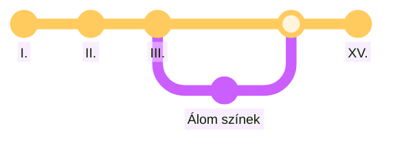

## Madách helye irodalmunkban
- Az ember tragédiáját írta meg mely a magyar irodalmat nagy mértékben befolyásolta 
## A drámai költemény műfaji jellemzői
- Lírai dráma
- Nem hagyományos felvonásokra épül hanem színekre tagolódik
## Irodalmi előzmények
- **Goethe**: Faust
- **Byron**: Kain, Manfred
- **Milton**: Az elveszett paradicsom
- **Vörösmarty**: Csongor és Tünde
- **Petőfi** Az apostol
## Mű keletkezésének ideje: 1859- 1860
## Személyes és történelmi, természettudományi háttér
- Arany Jánosnak küldi el
- a Faust gyenge utánzatának tartja
- "Petőfi óta az első író, aki önálló irányt mutat." Tompa Mihálynak írta
- Javít a stíluson/verselésen 4080 -> 4140 sor
- magánéleti csalódások
  - elvált a feleségétől (Fráter Erzsébet)
  - öccse Pál tüdőgyulladásban meghal
  - nővérét és családját román parasztok megölik (=> csalódása a népben)
- '48/49-es forradalom és szabadságharc leverése miatti kétségbe esés
- 19. századi természettudomány tanításai:
  - koponyatan (frenológia)
  - elméletek a nap kihűléséről (entrópiaelv)
## Szerkezet (füzet) 
### Keretszínek
- A mennyekben
- A paradicsomban
- A paradicsomon kívül
- A paradicsomban

### Történeti színek
- **Ókor**: Egyiptom, Athén, Róma
- **Középkor**: Konstantinápoly, Prága I., Párizs, Prága II.
- **Madách jelene**: London
- **Jövő**: Falanszter, űr, eszkimó szín
### Álom az álomban = Párizs
- A nagy francia forradalom ideje
- Álom az álomban
- **Szereplők**:
  - Ádám - Danton
  - Éva - Márkinő -> Pórnő
  - Lucifer - Bakó
- **Eszme**: "EGYENLŐSÉG
		  TESTVÉRISÉG
		  SZABADSÁG"
  nem ezekben csalódott Ádám (a gyakorlat elutasítja a legnemesebb ideált is)
## A hegeli triáda
A színek egymáshoz való viszonya:
- eszme (tézis) -><- ellentétes eszme (antitézis)
- új eszme (szintézis)
## Ádám, Éva, Lucifer szerepe a Tragédiában
- **Lucifer - Ádám**:
  Madách meghajolt gondolatait közvetíti
  párbeszédük = belső vita
- Ádám és Lucifer Madách két énje.

Ádám                                | -><- | Lucifer
----------------------------------- | :--: | ---
forradalomban vezető                |      | A forradalom leverés utáni időszak
hisz az emberiség fejlődésében      |      | A történelem körforgás, nincs fejlődés
szabadság hirdetése                 |      | Az ember kiszolgáltatott
liberalizmus, idealizmus, Romantika |      | Tények tapasztalatok, materializmus
Az ember irányíthatja a sorsát      |      | Determinizmus
Az ember társadalmi lény            |      | Az ember természeti lény
Eszmék befolyásolják, hit, bizalom  |      | Kétkedés, tagadás, értelem

- **Éva**:
  - Lucifer ellensége (Az éden emléke, szépség, költészet)
  - A jelenben él, ritkán emlékszik
  - A kor alakítja őt, Ádám megmentője, kompenzációja az Éden elvesztéséért
## Az eszmék sorsa a Tragédiában
### Ókor
- **Egyiptom**: Szabadság
  "Míljjog" elv, dicsőség, halhatatlanság <=> Ádám ebből ábrándul ki az egy milliók miatt elv jegyében felszabadítja a rabszolgákat
- **Athén**: Szabadság és egyenlőség eszméje -><- De a vén dagákok hatása alá kerül, illetve kiszolgáltatott -> Ádám eszmék nélküli világba vágyik
- **Róma**: Hedonizmus (az élvezet fontosságát jelölő filozófia, élet felfogás)
### Középkor
- **Konstantinápoly**: Eltorzul a testvériség eszme
  A kereszt a szeretet jelképe -><- a keresztes lovagok = rablók
  homousion: Isten = Jézus
  homoiusion: Jézus Isten fia
- **Párizs**: "EGYENLŐSÉG
		  TESTVÉRISÉG
		  SZABADSÁG"
  nem ezekben csalódott Ádám (a gyakorlat elutasítja a legnemesebb ideált is)
- **Prága**: Tudományok világa <-> Ádám kiábrándul a középkori tudományokból.
  A társadalom korlátozza a tudományt, az egyéniséget
  (Boszorkányság, jóslat, horoszkóp)
  A tudás kiszolgáltatott
### Madách jelene
- **London**: Szabadság, Egyenlőség, Testvériség eszme megcsúfolása
### Jövő
- **Falanszter**: Az egyenlőség és testvériség eszméje megvalósul: nincsenek különbségek
  -> egyenruha, egyenlő részek, nincsenek nevek (helyette számok vannak) 
  Megélhetés és élet megmentése
  Nincs helye az egyéniségnek és az érzelmeknek
  Fourier (= furié) álmodta meg
- **Űr**: A föld szellemének hívó szava vissza hívja a földre.
  Nem ura a földnek, hanem rabja, anyaghoz kötött, nem juthat túl a föld hatókörén.
- **Eszkimó szín**: Ádám azt remélte, hogy a tudomány szembe tudott szállni az élettel <-> Ádám korcs nemzetéket talál -> Az élet fenntartásért egymást gyilkolják
## Az ókori színek részletesen ( füzet )
### IV. szín - Egyiptom
  - Rabszolga tartó társadalom
  - szereplők
    - Ádám - ifjúfáraó
    - Lucifer - fáraó minisztere
    - Éva - rabszolga nő
- **Eszme**: Szabadság
  "Míljog" elv, dicsőség, halhatatlanság <=> Ádám ebből ábrándul ki az egy milliók miatt eb jegyében felszabadítja a rabszolgákat
### V. szín - Athén
- Athéni demokrácia
- **Szereplők**:
  - Ádám - Miltiádész (görög hadvezér)
  - Lucifer
  - Éva - Miltiádész/Ádám felesége
- **Eszme**:
  Szabadság és egyenlőség eszméje -><- De a nép a dogákok hatása alá kerül, illetve kiszolgáltatott -> Ádám eszmék nélküli világba vágyik
### VI. szín - Róma
- Rabszolgatartó társadalom
- **Szereplők**:
  - Dőzsölő ifjak: Ádám (Sergialus), Lucifer (Miló)
  - Éva (Júlia)
- **Eszme**: Hedonizmus (= az élvezetek fontosságát jelölő filozófia, élet felfogás)
- Péter apostol megjelenése, új eszmét hoz -> kereszténység által képviselt szeretet, TESTVÉRISÉG
## XV. szín - Paradicsomon kívül:
- Ádám felébred
- Szabad akarat - véget kell vetni az egésznek
- Éva: "Anyának érzem, óh, Ádám magam."
- Az Úr újra kegyeibe fogadja
- 3 kérdéssel fordul az Úrhoz:
  1. "E szűk hatású lét-e mindenem?"
  2. "Megy-é előbbre majdan fajzatom?"
  3. "Van-é jutalma a nemes kebelnek?"
	 Nincs egyértelmű válasz
	"Mondattam ember: küzdj és bízva bízzál!"
- A kétségben való küzdés az ember erkölcsi nagyságának biztosítása. Az állandó újrakezdés szükségességét kezdeti.
- **Segítői**:
  - égi szózat
  - lelki ismeret (saját maga)
  - Éva; - Lucifer tudása, tagadása "forrásba hozza"
## A mű üzenete
A csalódás ellenére küzdeni kell az emberiség jobb jövőéért
## Jankovics Marcell animációs filmje
- Gyártása 1988-ban kezdődött és 2011-ben ért véget
### Díjak
- A Nemzetközi Képzőművészeti Filmszemle fődíja
## Egyéb
---
**Memoriterek**: [[Az ember tragédiája|„Be van fejezve….”, „Fukar kezekkel mérsz…” és „A cél voltaképp mi is?”]] szállóigék